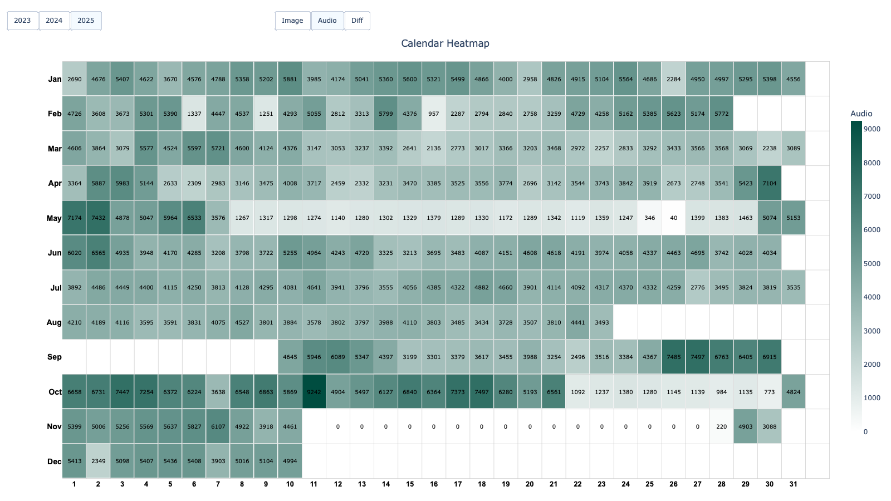
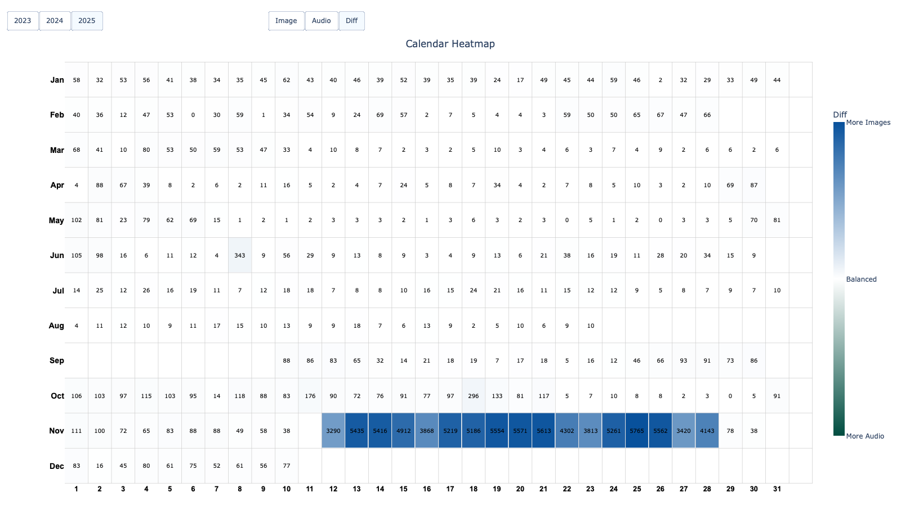
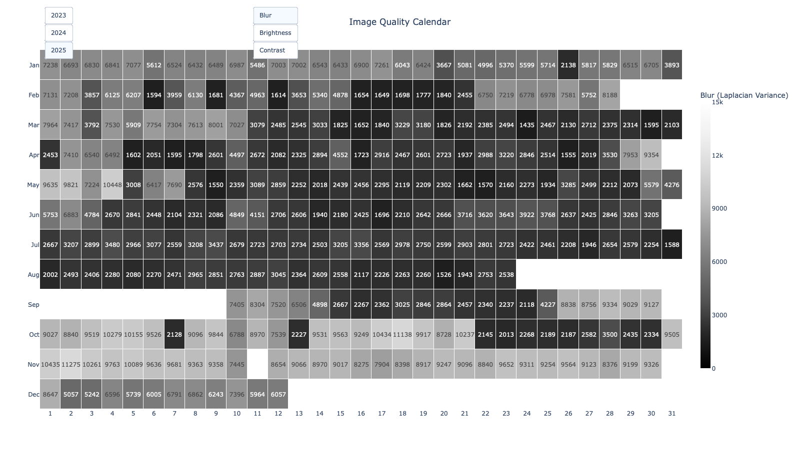
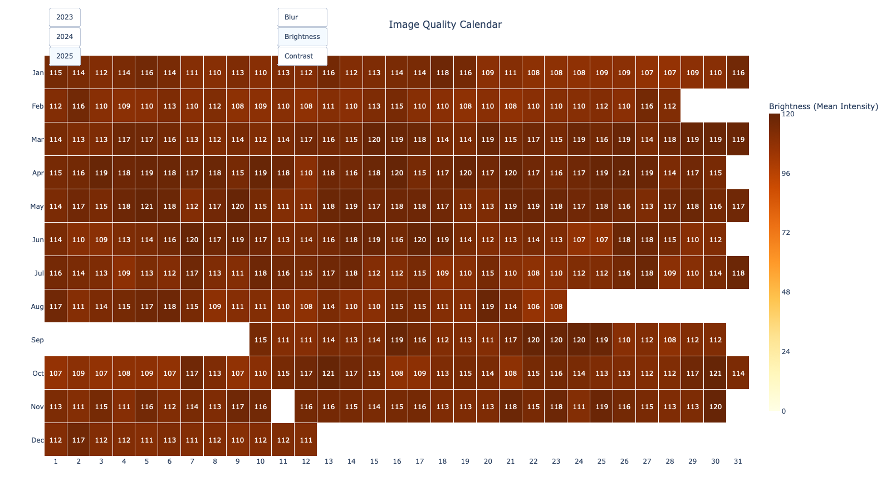
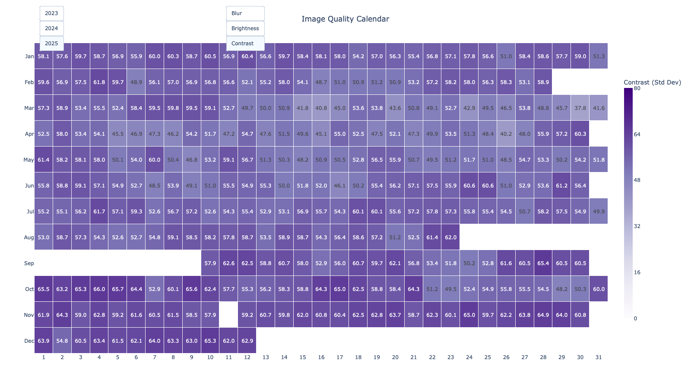
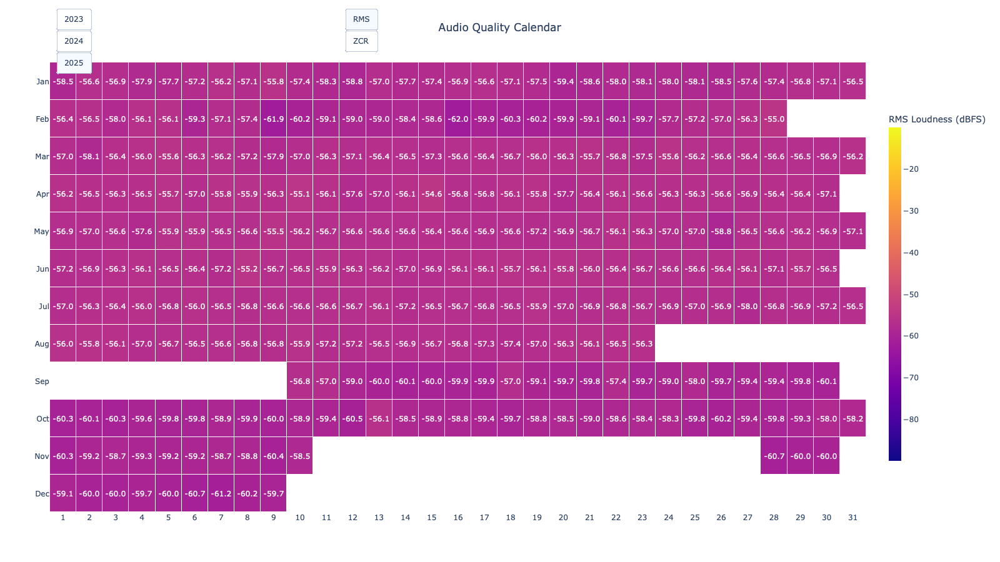
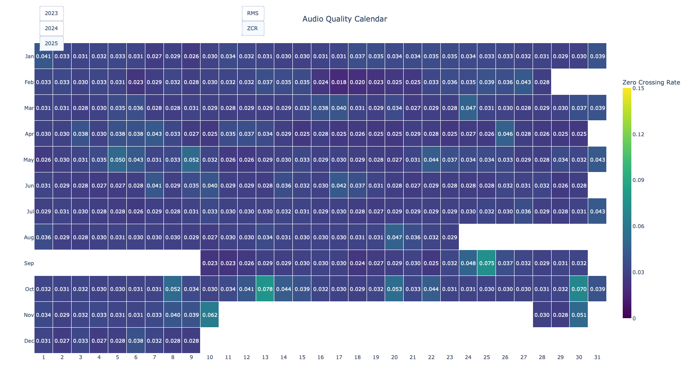
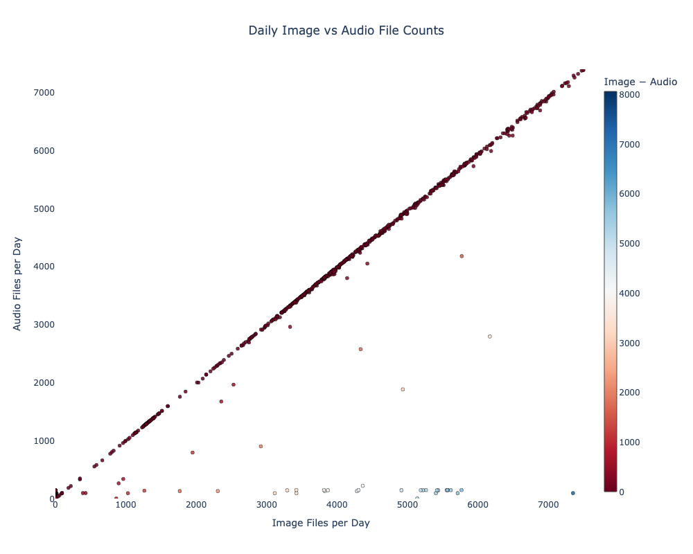
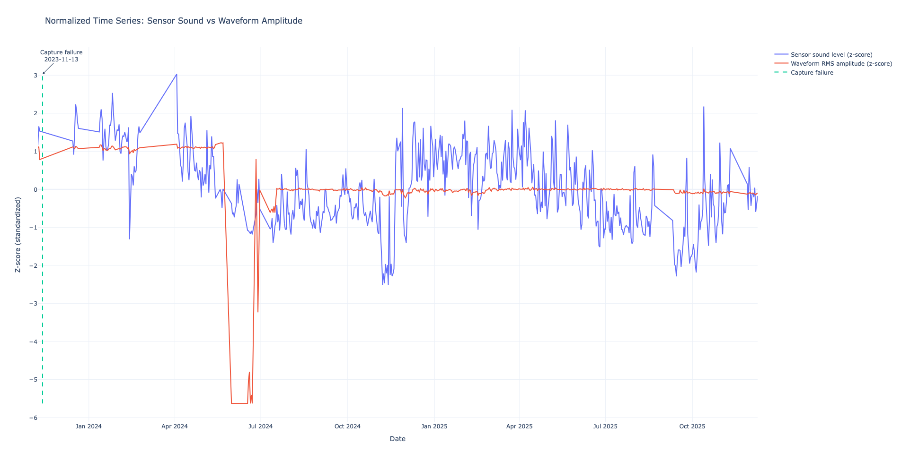

# IA626 Final Project  
## Multi-modal Traffic Sensor Validation Using Image and Audio Data

---

## 1. Project Summary

This project analyzes large-scale multi-modal traffic data collected from roadside sensors, combining **image files**, **audio files**, and **sensor metadata logged as newline-delimited JSON**. The primary objective is to perform a **holistic validation and exploratory analysis of multi-modal traffic sensor data**, integrating sensor-reported metadata with **independently derived audio signal metrics** and **image quality measurements**.

Rather than focusing on prediction, the project is framed as a **data validation and diagnostic analysis**, assessing system reliability, cross-modal consistency, and potential failure modes in a real-world sensing pipeline.

---

## 2. Primary Questions

### Primary Question

**Do sensor-reported measurements and file-system–derived data (audio and image) exhibit stable, interpretable, and temporally consistent relationships across modalities, and can deviations from these relationships be used to identify sensor or pipeline anomalies?**

### Secondary Questions

- **Audio consistency**  
  Is there a stable relationship between sensor-reported sound levels (dBA) and waveform-derived audio amplitude metrics?

- **Capture persistence**  
  Are there periods where sensors report activity but corresponding files are missing, sparse, or degraded?

- **Cross-modal availability**  
  How do image and audio capture rates co-vary over time, and are there systematic imbalances between modalities?

- **Image quality stability**  
  Do image quality metrics (blur, brightness, contrast) exhibit temporal drift or abrupt degradation?

- **Anomaly isolation**  
  Can isolated failures be distinguished from long-term drift or seasonal effects using multi-modal context?

---

## 3. ETL Pipeline Overview

The ETL process is implemented as a **multi-branch, log-driven pipeline**. Sensor logs define the authoritative event timeline, while image and audio data are processed independently to enable non-circular validation.

### 3.1 Log-Driven Event Extraction (Foundation Layer)

**Input**
- Newline-delimited JSON traffic logs (`traffic.txt*`)

**Process**
- Parse timestamps, file paths, and sensor configuration
- Extract sensor-reported audio measurements (`snd_lvl`, rolling `dba[]`)
- Normalize timestamps and calendar dates

**Output**
- Structured CSVs indexing sensor events and referenced files

---

### 3.2 Audio Waveform Quality Extraction (Signal Branch)

**Input**
- Raw `.mp3` audio files

**Process**
- Offline waveform decoding
- RMS amplitude, zero-crossing rate (ZCR), duration, file size
- Daily aggregation aligned to event dates

**Output**
- `audio_quality.csv`
- `audio_quality_daily.csv`

---

### 3.3 Audio Sensor Aggregation (Sensor Branch)

**Input**
- Parsed traffic logs

**Process**
- Aggregate rolling dBA windows
- Compute daily summary statistics

**Output**
- `audio_sensor_daily.csv`

---

### 3.4 Image Quality Extraction (Vision Branch)

**Input**
- Raw traffic images

**Process**
- Compute blur (Laplacian variance), brightness, contrast, file size
- File-level persistence and daily aggregation
- Outlier clipping

**Output**
- `image_quality.csv`
- `image_quality_daily.csv`
- `image_quality_daily_clipped.csv`

---

### 3.5 Cross-Modal Integration

**Process**
- Date-based joins across modalities
- Normalization and alignment
- Persistence and imbalance metrics

**Purpose**
Enable cross-modal interpretation of anomalies as:
- Capture failures
- Modality-specific degradation
- System-level issues

---

## 4. Analysis Approach

The analysis is structured around **three complementary perspectives**:
1. Sensor–signal consistency
2. Cross-modal data availability
3. Image quality stability

---

## 5. Visualizations and Interpretation

All figures are generated via scripts and saved as **PNG (static)** and **HTML (interactive)**.  
The visualizations are designed to support **cross-modal validation**, allowing patterns observed in one modality to be confirmed or challenged using another.

---

## 5.1 Image and Audio Availability Heatmaps

These calendar heatmaps visualize **daily file availability** for image and audio data, as well as their **difference**, across the observation period.

**Images**
- 
- 
- 

**Description**  
The first two heatmaps show the number of image and audio files captured per day, respectively.  
The difference heatmap highlights days where one modality is substantially over- or under-represented relative to the other.

### Interpretation

Under normal operation, image and audio capture volumes exhibit **strongly aligned temporal structure**, reflecting shared triggering mechanisms and consistent pipeline behavior. This coherence supports the assumption that both modalities are responding to the same underlying traffic activity.

However, a small number of **isolated days** exhibit pronounced imbalance—typically high image counts paired with minimal or zero audio persistence, or vice versa. These patterns are unlikely to reflect real-world traffic dynamics and instead indicate **modality-specific capture or persistence failures**, such as audio encoder issues, temporary storage disruptions, or pipeline interruptions.

Crucially, these imbalances are **sporadic rather than sustained**, suggesting transient failures rather than systemic misconfiguration.

---

## 5.2 Image Quality Calendar Heatmaps

These figures evaluate the **temporal stability of image quality**, independent of capture volume.

**Images**
- 
- 
- 

### Interpretation

Across the majority of the observation period, blur, brightness, and contrast metrics remain **remarkably stable**, indicating consistent camera focus, exposure, and configuration. This stability suggests that variations observed in capture volume or downstream performance are **not driven by gradual camera degradation**.

Where abrupt, localized deviations occur, they are confined to short time windows and do not persist. Such behavior is more consistent with **temporary obstructions, brief defocus events, or short-lived configuration changes** than with long-term drift. The absence of widespread degradation patterns supports the conclusion that the imaging system is generally robust.

---

## 5.3 Audio Quality Calendar Heatmaps (Waveform-Derived)

These heatmaps summarize **waveform-derived audio quality metrics** at a daily resolution.

**Images**
- 
- 

### Interpretation

Daily RMS amplitude and zero-crossing rate (ZCR) exhibit coherent temporal structure, indicating stable audio signal characteristics under normal operation. Periods of low RMS or anomalous ZCR align with known low-activity intervals or with days flagged as capture anomalies in availability analyses.

Importantly, these signal-derived metrics provide **independent validation** of sensor-reported audio levels. When waveform quality metrics diverge sharply from sensor reports—particularly on days with missing audio files—the discrepancy points to **persistence or extraction failures**, not genuine changes in ambient sound.

---

## 5.4 Sensor Sound Level vs Audio Capture Volume

This scatter plot compares **sensor-reported sound levels** with the **number of audio files persisted per day**.

**Image**
- 

### Interpretation

A strong linear relationship is present. Most days form a dense, coherent cluster, confirming that higher sensor-reported sound levels generally correspond to greater audio capture volume. This relationship reflects expected system behavior and supports the validity of both sensor measurements and waveform extraction under normal conditions.

A small number of clear outliers exhibit **high sensor-reported loudness paired with near-zero audio persistence**. These points are strong indicators of **audio capture failure**, where the sensor reports activity but the audio pipeline fails to persist corresponding files. The isolation of these outliers further supports the interpretation of transient failure rather than persistent malfunction.

---

## 5.5 Sensor vs Waveform Amplitude (Normalized Time Series)

This figure compares **sensor-reported sound levels** and **waveform-derived RMS amplitude** after z-score normalization.

**Image**
- 

### Interpretation

For most of the observation period, the two normalized series exhibit **strong temporal coherence**, indicating that both sensor-reported and waveform-derived metrics respond similarly to underlying environmental conditions.

Divergence between the series is rare and temporally isolated. Notably, these deviations align with days identified as capture failures in availability and scatter analyses. This confirms that **persistence-based anomalies**, rather than signal amplitude alone, are the dominant failure mode.

Overall, the normalized time series demonstrates that observed anomalies are **isolated events**, not part of broader drift or seasonal patterns, reinforcing confidence in the long-term stability of the sensing system.

---

## 6. Repository Structure

```text
ia626_project/
├── scripts/      # ETL and figure-generation scripts
├── results/      # Generated CSV outputs
├── figures/      # PNG and HTML visualizations
└── README.md
```

## 7. Reproducibility

- All transformations are script-driven  
- Raw data are omitted due to size constraints  
- Directory structure and data schemas are fully documented  
- Each ETL branch can be rerun independently  
- All figures are reproducible from versioned CSV outputs 
- Interactive plots available in figures/

---

## 8. Code / API Appendix

- Python 3.10  
- pandas  
- numpy  
- librosa  
- plotly  
- matplotlib  
- pathlib  

All dependencies are open-source. No proprietary APIs or external services are required.

---

## 9. Conclusion

This project demonstrates how **multi-modal sensor systems** can be rigorously validated using a **log-driven, cross-modal ETL design**. By independently deriving signal- and image-based metrics and aligning them with sensor metadata, the analysis avoids circular validation and enables robust anomaly detection.

The results show that:
- Normal operation exhibits stable cross-modal relationships  
- Anomalies are rare, isolated, and modality-specific  
- Image quality remains stable over long periods  
- Cross-modal reasoning is essential for correct interpretation  

Overall, the project illustrates how careful pipeline design and targeted visualization can transform heterogeneous sensor data into interpretable evidence of system performance and reliability.